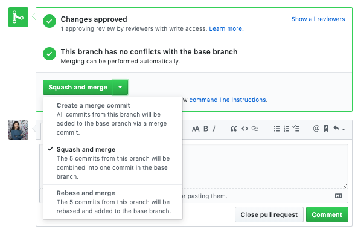
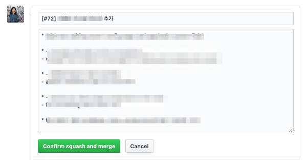

# TEAM NAME
## Contributors

## Projects 

| Project | Description |  Main Contributors |
| ------- | :-----| :-----:|
| [dear-github](https://github.com/dear-github/dear-github) | 📨 An open letter to GitHub from the maintainers of open source projects
  |     |

## Branch 규칙  
- develop 
- beta 
- master 

## Pull Request 규칙 
- **1 Issue** + **1 PR** + **1+ Reviewer** 
- PR을 날릴 때는 최소 한명 이상의 reviewer를 지정하여야 하며 'draft pull request'를 이용
  - 사안에 따라 (간단한 typo fix, 팀 내에 리뷰를 받을 준비가 안되어 있는 경우 등) 작업자의 판단 하에 리뷰어 지정을 건너뛸 수 있음
  - 기본적으로는 PR을 날릴 때 리뷰어가 있어야 함
- 이슈 생성 후 branch 생성 : `feature/issues-#issuenumber` ( e.g. `feature/issues-123` )  
  
- **Squash & Merge**

  - 장점 : 한 PR 내 여러 commit이 있을 경우, 모든 작업 이후 하나의 commit으로 만들어 히스토리를 깔끔하게 정리할 수 있습니다. 
  - Squash 시 commit message 규칙 : `[#PR넘버]메세지 내용` (커밋 히스토리와 함께 남깁니다.)

## 새로운 리파지토리 시작하기 
- 기본 Template 추가 및 수정하기 
  - [ ] [README template](./README_TEMPLATE.md)
  - [ ] [Issue & Pull Request template](./.github) 

- Default branch는 **master** 
  - master, develop, beta는 `Settings` -> `Branches` -> `Branch protection rules` 에서 삭제되지 않도록 설정합니다. 
